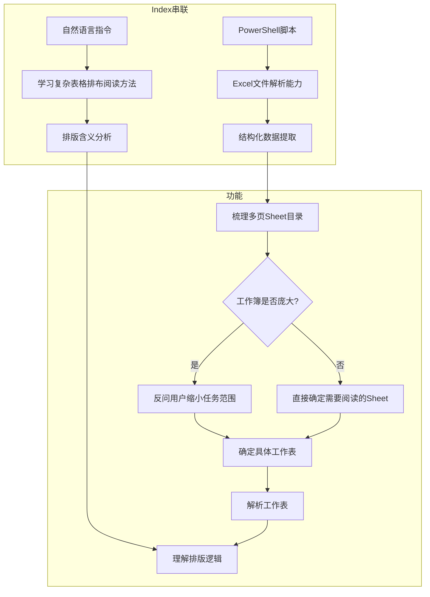
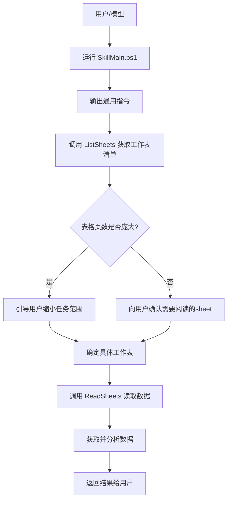

# fyaic-sheet-skill

**PowerShell脚本 + 自然语言指令** = 简单高效的工作表解析方案

### 表格理解增强
- ✅ 自动识别表头层级
- ✅ 理解合并单元格语义
- ✅ 还原树状结构（大阶段 → 子板块 → 具体动作）
- ✅ 处理空单元格和超链接

## Skill架构




## 快速开始

### 1. 准备环境
- **Windows**: PowerShell已内置
- **macOS/Linux**: 安装PowerShell Core
  ```bash
  brew install powershell  # macOS
  sudo apt install powershell  # Ubuntu/Debian
  ```

### 2. 克隆项目
```bash
git clone https://github.com/fyaic/fyaic-sheet-skill.git
cd fyaic-sheet-skill
```


## 工具使用流程

推荐入口脚本为 SkillMain.ps1。调用时优先运行该脚本，脚本会先输出 prompts/通用指令.md 的全部内容，再根据工作簿的工作表数量引导你选择要读取的工作表，并最终调用内部的脚本完成数据读取。



